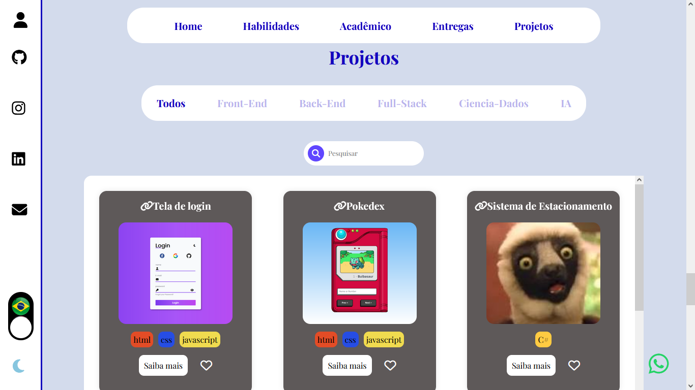

# Portfólio de Christopher Willians Silva Couto

## Sobre o Projeto

Olá, meu nome é Christopher Willians Silva Couto e este é o meu portfólio criado utilizando HTML, CSS e JavaScript. O projeto é dividido em cinco partes principais:

1. **Principais Projetos**: Um slider interativo que direciona o usuário para as páginas dos projetos.
2. **Saidbar**: Uma barra de navegação expansiva para links externos e mudança de tema.
3. **Seção de Entregas**: Um container que permite navegar entre os trabalhos que posso entregar sem sair do site.
4. **Seção dos Projetos**: Uma área com todos os meus projetos, incluindo uma aba de pesquisa e filtro.
5. **Informações Individuais dos Projetos**: Um detalhe individual de cada projeto que aparece ao clicar no projeto correspondente.

### Informações Pessoais

- **Nome**: Christopher Willians Silva Couto
- **Tempo de Estudo**: Aproximadamente um ano em programação com foco em fullstack, IA e ciência de dados
- **Formação**: Técnico em Análise e Desenvolvimento de Sistemas e atualmente cursando nível tecnólogo na mesma área no Instituto Federal de São Paulo (IFSP), campus Guarulhos.

## Seção 1: Principais Projetos

## Seção 2: Saidbar

## Seção 3: Seção de Entregas

## Seção 4: Seção dos Projetos

## Seção 5: Informações Individuais dos Projetos

